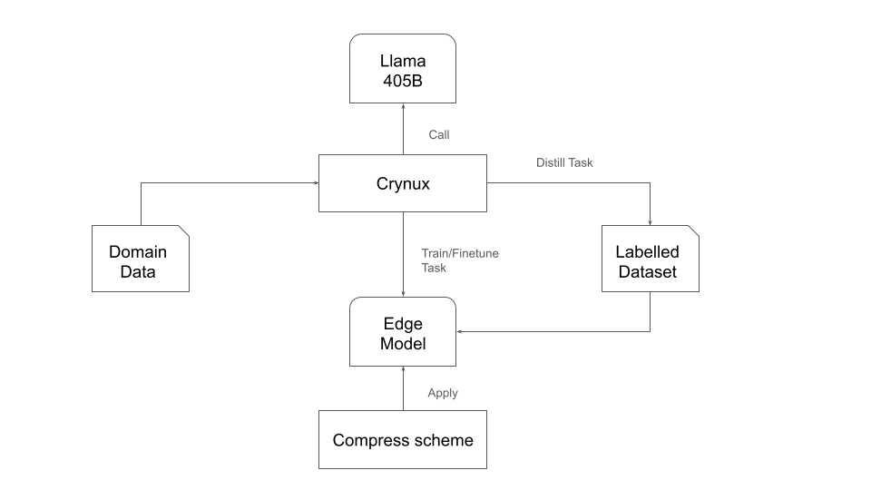

# ModelZip

Tired of running Llama 405B slowly and pricily? ModelZip utilizes Crynux to make model smaller and faster.

## Distillation

Crynux provides a very cheap computing power for batch inference, which is ideal for distillation.

1. ModelZip defines a distillation task that can be executed by Crynux node.
2. In each distillation task, it contains inference step and fine-tuning step.
3. ModelZip sends a batch of inference tasks to Crynux, and builds a labelled datasets by the teacher model, e.g. Llama 405B.
4. For fine-tuning step, Crynux node trains the model with the local labelled dataset and returns the gradient.
5. ModelZip aggregates the gradients, and start the new batch.

## Quantization

ModelZip provides both post-training quantization and quantization-aware training.

In the model training recipe, the model layer wrapped with quantization wrapper will be quantized during training.

## Pruning

ModelZip provides weight pruning to further compress the model size.

In the model training recipe, the model layer wrapped with pruning wrapper will be pruned during training.

## Factorization

ModelZip provides factorization to compress the model size.

In the model training recipe, the model layer wrapped with factorization wrapper will be factorized during training.

